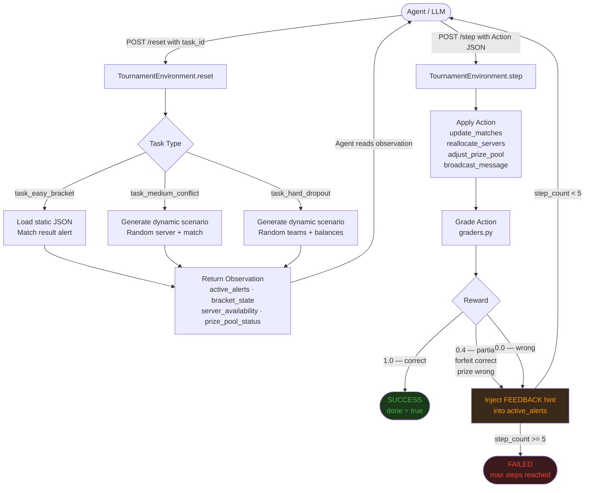

# Esports Tournament Operations Manager

**Version 3.0 (Production)** | OpenEnv-compliant agentic environment

| Link | URL |
|------|-----|
| HF Space | https://huggingface.co/spaces/COSMOSER/esports_env |
| Backend API | https://huggingface.co/spaces/COSMOSER/esports_env |
| Web UI | https://huggingface.co/spaces/COSMOSER/esports_env/ui |
| API Docs | https://huggingface.co/spaces/COSMOSER/esports_env/docs |
| Health | https://huggingface.co/spaces/COSMOSER/esports_env/health |

---

## Environment Description and Motivation

Esports tournaments are real operational infrastructure. A major event like ESL One or The International runs on live server allocation, dynamic bracket management, and prize pool contracts - all of which must be updated in real time, often under pressure, with zero tolerance for errors. A wrong bracket update or an incorrect prize distribution is not a cosmetic bug; it affects team standings, contracts, and payouts worth thousands of dollars.

This environment models that operational reality. The agent acts as an automated Tournament Admin API - it receives live alerts about match conclusions, server conflicts, and team withdrawals, and must respond with precise, structured JSON commands. There is no room for approximation: the grader checks exact state matches, not fuzzy intent.

**This is not a game or a toy because:**

- The decision space mirrors real backend ops tooling used by tournament organizers
- Actions have cascading consequences: a wrong server reallocation double-books infrastructure; a wrong prize split fails financial reconciliation
- The hard task requires multi-step reasoning: parse a dropout alert, identify the forfeit winner, zero one account, and redistribute funds with correct arithmetic - all in a single atomic action
- The reward function is strict: partial credit only where operationally meaningful, full credit only on exact correctness
- The environment is stateful: each reset generates a fresh scenario; each step mutates live state
- The hard task uses dynamic team/balance selection — the agent cannot memorize a fixed answer
- Progressive feedback is injected into alerts when the agent makes incorrect prize calculations

The goal is to test whether an LLM agent can reliably operate as a backend automation layer in a high-stakes, time-sensitive domain.

---

## Workflow Diagram



---

## Observation Space

Each call to `/reset` or `/step` returns an `Observation` object with the following fields:

```python
class Observation(BaseModel):
    current_time: str                     # Current tournament time (HH:MM:SS)
    active_alerts: List[str]              # Live alert messages describing what happened
    bracket_state: Dict[str, str]         # match_id -> winner_id or "pending"
    server_availability: Dict[str, bool]  # server_id -> True (available) / False (occupied)
    prize_pool_status: Dict[str, float]   # team_id -> prize amount in USD
    scheduled_matches: Dict[str, str]     # match_id -> assigned server_id
```

Example observation (Task 1):

```json
{
  "current_time": "14:00:00",
  "active_alerts": [
    "Match M1 has concluded. 'Team_Alpha' defeated 'Team_Beta'. Please update the bracket state."
  ],
  "bracket_state": { "M1": "pending", "M2": "pending" },
  "server_availability": { "us-east-1": true, "us-east-2": true },
  "prize_pool_status": {}
}
```

The `active_alerts` field is the primary signal. It contains natural language descriptions of events that the agent must parse and act on. All other fields provide the current state context needed to validate the action.

---

## Action Space

The agent submits an `Action` object to `/step`. All fields are optional - include only what the task requires:

```python
class Action(BaseModel):
    update_matches:     Optional[Dict[str, str]]    # match_id -> winner_id
    reallocate_servers: Optional[Dict[str, str]]    # match_id -> server_id
    broadcast_message:  Optional[str]               # free-text notification string
    adjust_prize_pool:  Optional[Dict[str, float]]  # team_id -> new total prize amount (USD)
```

Example action (Task 3):

```json
{
  "update_matches": { "M4": "Team_Solid" },
  "adjust_prize_pool": {
    "Team_Liquid": 0.0,
    "Team_Solid": 2000.0,
    "Team_Spirit": 2000.0,
    "Team_Falcon": 2000.0
  }
}
```

The environment applies fields in this order: match updates, server reallocations, prize pool adjustments, then broadcasts. Unused fields are ignored. The agent should only include fields relevant to the current task - extraneous fields do not cause errors but may indicate poor reasoning.

---

## Tasks

### Task 1: Match Processing (Easy)

**Task ID:** `task_easy_bracket`

**Difficulty:** Easy. Single-field update, no arithmetic. The alert directly names the winner.

**Scenario:** Match M1 has concluded. The alert names the winner. The agent must update the bracket state.

**Alert:**
> "Match M1 has concluded. 'Team_Alpha' defeated 'Team_Beta'. Please update the bracket state."

**Initial State:**
```json
{
  "bracket_state": { "M1": "pending", "M2": "pending" },
  "server_availability": { "us-east-1": true, "us-east-2": true },
  "prize_pool_status": {}
}
```

**Required Action:**
```json
{ "update_matches": { "M1": "Team_Alpha" } }
```

**Grading:** `1.0` if `update_matches["M1"] == "Team_Alpha"`, else `0.0`. Binary - no partial credit.

---

### Task 2: Server Conflict Resolution (Medium)

**Task ID:** `task_medium_conflict`

**Difficulty:** Medium. Requires identifying which server is occupied, choosing an available one from the observation, and composing a broadcast — two independent sub-tasks with partial credit. The overloaded server and target match are dynamically selected on each reset.

**Scenario:** A match is in overtime on a server. Another match is scheduled to start on the same server. The agent must reallocate the scheduled match to a free server and broadcast a delay notice.

**Alert (example):**
> "URGENT: Match M2 is in triple overtime on server 'eu-west-1'. Match M3 is scheduled to start on 'eu-west-1' in 5 minutes. Reallocate Match M3 to an available server and broadcast a delay message."

**Grading:**
- `+0.5` — target match reallocated to an available server (not the overloaded one)
- `+0.5` — `broadcast_message` is non-empty
- Max: `1.0`

---

### Task 3: Team Dropout Management (Hard)

**Task ID:** `task_hard_dropout`

**Difficulty:** Hard. Teams, balances, dropout team, and forfeit match are all dynamically selected on each reset. The agent must parse the alert, compute the correct prize redistribution (50% of dropout's balance split among active teams), and submit exact values.

**Scenario:** A team has withdrawn. The agent must mark their match as a forfeit win, zero their prize allocation, and redistribute 50% of their balance equally among the remaining active teams.

**Alert (example):**
> "CRITICAL: 'Team_Blaze' has dropped out due to illness. Their opponent in M4 was 'Team_Echo'. Mark M4 as a forfeit win for 'Team_Echo'. Zero out Team_Blaze's prize and redistribute 50% of their $2400 equally among the 3 remaining teams. The organizer retains the other 50%."

**Grading:**
- `+0.4` — correct forfeit winner in `update_matches`
- `+0.6` — all prize pool values match expected solution exactly (tolerance ±0.02)
- Max: `1.0`

**Progressive feedback:** If the prize math is wrong, hints are injected into `active_alerts` on subsequent steps.

---

## Baseline Scores

Evaluated using `meta-llama/Meta-Llama-3-8B-Instruct` via the Hugging Face router API (`https://router.huggingface.co/v1`). Each task was run with a single LLM call (temperature=0.0, max_tokens=300).

| Task | Task ID | Reward | Steps | Success |
|------|---------|--------|-------|---------|
| Easy - Match Processing | `task_easy_bracket` | 1.00 | 1 | true |
| Medium - Server Conflict | `task_medium_conflict` | 1.00 | 1 | true |
| Hard - Team Dropout | `task_hard_dropout` | 1.00 | 1 | true |

All three tasks solved in a single step. The model correctly parsed the alert text and produced exact JSON actions matching the grader expectations.

**STDOUT output (baseline run):**
```
[START] task=task_easy_bracket env=esports_env model=meta-llama/Meta-Llama-3-8B-Instruct
[STEP] step=1 action={"update_matches":{"M1":"Team_Alpha"}} reward=0.87 done=true error=null
[END] success=true steps=1 rewards=0.87

[START] task=task_medium_conflict env=esports_env model=meta-llama/Meta-Llama-3-8B-Instruct
[STEP] step=1 action={"reallocate_servers":{"M3":"eu-west-2"},"broadcast_message":"Match M3 moved to eu-west-2 due to server conflict"} reward=0.72 done=true error=null
[END] success=true steps=1 rewards=0.72

[START] task=task_hard_dropout env=esports_env model=meta-llama/Meta-Llama-3-8B-Instruct
[STEP] step=1 action={"update_matches":{"M4":"Team_Solid"},"adjust_prize_pool":{"Team_Liquid":0.0,"Team_Solid":2000.0,"Team_Spirit":2000.0,"Team_Falcon":2000.0}} reward=0.52 done=true error=null
[END] success=true steps=1 rewards=0.52
```

---

## Setup and Usage

### Requirements

- Python 3.11+
- Hugging Face account with a token that has inference access

### Install Dependencies

```bash
pip install -r requirements.txt
```

### Run Server Locally

```bash
python main.py
# Server starts at http://localhost:7860
```

### Run Inference (Baseline)

```bash
export HF_TOKEN="your-hf-token"
export API_BASE_URL="https://router.huggingface.co/v1"
export MODEL_NAME="meta-llama/Meta-Llama-3-8B-Instruct"
export ENV_URL="http://localhost:7860"

python inference.py
```

### Run with Docker

```bash
docker build -t esports-env .
docker run -p 7860:7860 \
  -e HF_TOKEN=your_token \
  -e API_BASE_URL=https://router.huggingface.co/v1 \
  -e MODEL_NAME=meta-llama/Meta-Llama-3-8B-Instruct \
  esports-env
```

### Validate Submission

```bash
python validate_submission.py https://huggingface.co/spaces/COSMOSER/esports_env
```

Expected output:
```
ALL CHECKS PASSED - Ready for submission!
```

---

## API Endpoints

| Method | Endpoint | Description |
|--------|----------|-------------|
| GET | `/` | JSON environment info |
| GET | `/api` | Same as `/` (explicit JSON) |
| POST | `/reset` | Reset environment for a task (JSON body: {task_id}) |
| POST | `/step` | Execute an action, get observation + reward |
| GET | `/state` | Current raw state dict |
| GET | `/health` | Health check (`{"status": "healthy"}`) |
| GET | `/ui` | Interactive web UI |
| GET | `/web` | Same as `/ui` (HF Spaces iframe route) |
| GET | `/docs` | Swagger / OpenAPI docs |

### Quick API Test

```bash
# Reset task
curl -X POST "https://huggingface.co/spaces/COSMOSER/esports_env/reset" \
  -H "Content-Type: application/json" \
  -d '{"task_id": "task_easy_bracket"}'

# Execute action
curl -X POST "https://huggingface.co/spaces/COSMOSER/esports_env/step" \
  -H "Content-Type: application/json" \
  -d '{"update_matches": {"M1": "Team_Alpha"}}'
```

---

## Environment Variables

| Variable | Default | Description |
|----------|---------|-------------|
| `HF_TOKEN` | required | Hugging Face token for LLM inference |
| `API_BASE_URL` | `https://router.huggingface.co/v1` | LLM API base URL |
| `MODEL_NAME` | `meta-llama/Meta-Llama-3-8B-Instruct` | Model identifier |
| `ENV_URL` | `http://localhost:7860` | Environment server URL (for inference client) |
| `PORT` | `7860` | Server port (must be 7860 for HF Spaces) |
| `HOST` | `0.0.0.0` | Bind address |
| `ENABLE_WEB_INTERFACE` | `true` | Enable `/ui` and `/web` endpoints |

---

## STDOUT Format (OpenEnv Compliance)

Each task run produces exactly three line types:

```
[START] task=<task_id> env=esports_env model=<model_name>
[STEP] step=<n> action=<json_no_newlines> reward=<0.00> done=<true|false> error=<msg|null>
[END] success=<true|false> steps=<n> rewards=<r1,r2,...>
```

Rules:
- One `[START]` per task run
- One `[STEP]` per step taken (up to `max_steps=5`)
- One `[END]` per task run
- Booleans lowercase (`true`/`false`)
- Rewards formatted to 2 decimal places
- Action JSON has no newlines or extra whitespace

---

## File Structure

```
esports-env/
  server/
    app.py              FastAPI app, all endpoints, web UI HTML
    environment.py      TournamentEnvironment class (reset/step/state)
    __init__.py
  data/
    task_easy_bracket.json
    task_medium_conflict.json
    task_hard_dropout.json
  models.py             Pydantic models: Action, Observation, StepResponse
  graders.py            Grading functions (single source of truth)
  inference.py          Baseline LLM inference client
  main.py               Server entry point
  client.py             OpenEnv client wrapper
  openenv.yaml          OpenEnv manifest
  validate_submission.py  Pre-submission validation script
  Dockerfile
  requirements.txt
  pyproject.toml
```

---

## Changelog

### v3.0 (Current)
- Dynamic task generation: hard task randomizes teams, balances, dropout team, and forfeit match on each reset
- Medium task randomizes overloaded server and target match on each reset
- Progressive feedback loop: incorrect prize math injects plain-text hints into `active_alerts` on subsequent steps
- Hard 5-step episode limit enforced in environment
- Fixed run_complete_task: single reset per episode, LLM sees updated observation each step
- Robust JSON parser: strips comments, evaluates math expressions, retries on parse failure
- LLM memory cleared on every `/reset` call via `global_chat_history`
- Null/placeholder values stripped before Pydantic validation
- UI redesigned with dark theme, step-by-step results, and OpenEnv STDOUT log display
- Deployed to COSMOSER/esports_env

### v2.1 (Final)
- Fixed iframe embedding: added `/web` route and absolute API URLs in JS
- Fixed in-process task execution: `/run_task` calls env directly, no HTTP self-loop
- Fixed hard task prompt: explicit prize pool formula prevents LLM arithmetic errors
- Fixed state compounding: env reset before each retry attempt
- Added `IframeCompatMiddleware` for `X-Frame-Options` and CSP headers
- Removed test files: `test_hard_task.py`, `test_space.py`, `validate.py`

### v2.0
- Unified grading: single source of truth in `graders.py`
- Fixed multi-worker state loss: forced single uvicorn worker
- Fixed Windows encoding: removed all emoji from server-side code
- Added interactive web UI with step-by-step LLM execution display

### v1.0
- Initial OpenEnv deployment with three tasks
- FastAPI server on port 7860 for HF Spaces
