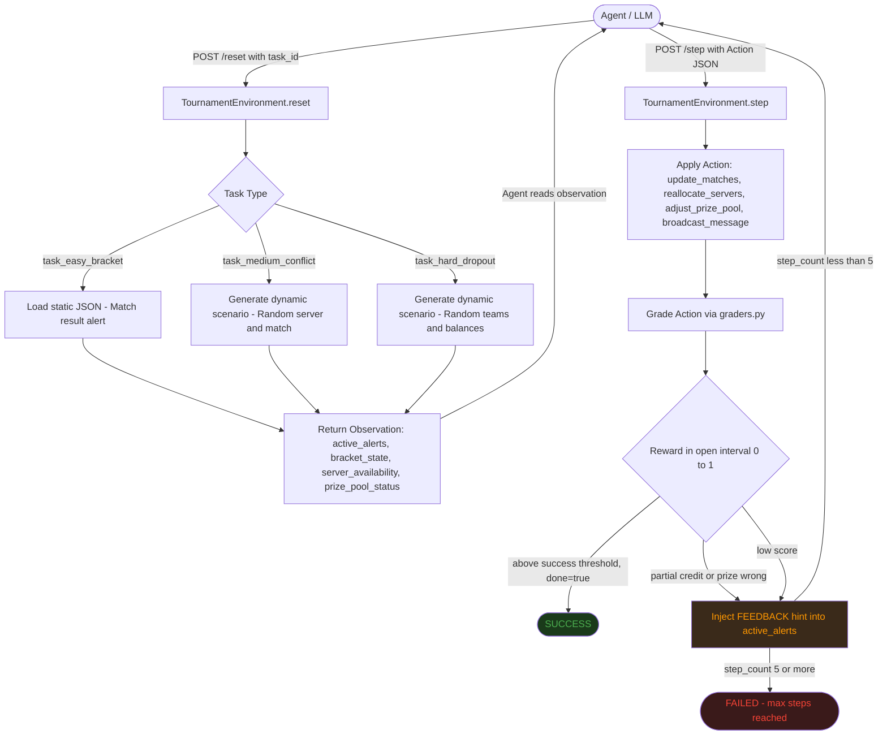

# Esports Tournament Operations Manager

**Version 3.1** | OpenEnv-compliant agentic environment

| Link | URL |
|------|-----|
| HF Space | https://huggingface.co/spaces/Debadrit/esports_env |
| Web UI | https://huggingface.co/spaces/Debadrit/esports_env/ui |
| API Docs | https://huggingface.co/spaces/Debadrit/esports_env/docs |
| Health | https://huggingface.co/spaces/Debadrit/esports_env/health |

---

## Environment Description and Motivation

Esports tournaments are real operational infrastructure. A major event like ESL One or The International runs on live server allocation, dynamic bracket management, and prize pool contracts — all updated in real time, often under pressure, with zero tolerance for errors. A wrong bracket update or an incorrect prize distribution is not a cosmetic bug; it affects team standings, contracts, and payouts worth thousands of dollars.

This environment models that operational reality. The agent acts as an automated Tournament Admin API — it receives live alerts about match conclusions, server conflicts, and team withdrawals, and must respond with precise, structured JSON commands.

**Why this is not a toy:**

- The decision space mirrors real backend ops tooling used by tournament organizers
- Actions have cascading consequences: a wrong server reallocation double-books infrastructure; a wrong prize split fails financial reconciliation
- The hard task requires multi-step reasoning: parse a dropout alert, identify the forfeit winner, zero one account, and redistribute funds with correct arithmetic
- The reward function is strict: partial credit only where operationally meaningful
- The environment is stateful: each reset generates a fresh scenario; each step mutates live state
- The hard task uses dynamic team/balance selection — the agent cannot memorize a fixed answer
- Progressive feedback is injected into alerts when the agent makes incorrect prize calculations

---

## Workflow Diagram



---

## Observation Space

Each call to `/reset` or `/step` returns an `Observation` object:

```python
class Observation(BaseModel):
    current_time: str                     # Current tournament time (HH:MM:SS)
    active_alerts: List[str]              # Live alert messages describing what happened
    bracket_state: Dict[str, str]         # match_id -> winner_id or "pending"
    server_availability: Dict[str, bool]  # server_id -> True (available) / False (occupied)
    prize_pool_status: Dict[str, float]   # team_id -> prize amount in USD
    scheduled_matches: Dict[str, str]     # match_id -> assigned server_id
```

Example observation (Task 1):

```json
{
  "current_time": "14:00:00",
  "active_alerts": [
    "Match M1 has concluded. 'Team_Alpha' defeated 'Team_Beta'. Please update the bracket state."
  ],
  "bracket_state": { "M1": "pending", "M2": "pending" },
  "server_availability": { "us-east-1": true, "us-east-2": true },
  "prize_pool_status": {}
}
```

The `active_alerts` field is the primary signal. All other fields provide state context needed to validate the action.

---

## Action Space

The agent submits an `Action` object to `/step`. All fields are optional — include only what the task requires:

```python
class Action(BaseModel):
    update_matches:     Optional[Dict[str, str]]    # match_id -> winner_id
    reallocate_servers: Optional[Dict[str, str]]    # match_id -> server_id
    broadcast_message:  Optional[str]               # free-text notification string
    adjust_prize_pool:  Optional[Dict[str, float]]  # team_id -> new total prize amount (USD)
```

Example action (Task 3):

```json
{
  "update_matches": { "M4": "Team_Solid" },
  "adjust_prize_pool": {
    "Team_Liquid": 0.02,
    "Team_Solid": 2000.0,
    "Team_Spirit": 2000.0,
    "Team_Falcon": 2000.0
  }
}
```

---

## Tasks and Scoring

All rewards are strictly within `(0, 1)` — never exactly `0.0` or `1.0`. The minimum possible reward is `0.02` and maximum is `0.98`. Rewards are formatted to exactly 2 decimal places in STDOUT output.

### Task 1: Match Processing (Easy)

**Task ID:** `task_easy_bracket`  
**Max reward:** `0.87` | **Success threshold:** `0.75`

**Scenario:** Match M1 has concluded. The alert names the winner. The agent must update the bracket state.

**Alert:**
> "Match M1 has concluded. 'Team_Alpha' defeated 'Team_Beta'. Please update the bracket state."

**Required Action:**
```json
{ "update_matches": { "M1": "Team_Alpha" } }
```

**Score breakdown:**

| Condition | Score |
|-----------|-------|
| Correct winner, no extra fields | `0.87` |
| Correct winner + unnecessary reallocate or prize | `0.82` |
| Correct winner + unnecessary broadcast | `0.84` |
| Correct winner + all extra fields | `0.75` (floor) |
| Attempted wrong match ID | `0.25` |
| No `update_matches` field | `0.01` (minimum) |

---

### Task 2: Server Conflict Resolution (Medium)

**Task ID:** `task_medium_conflict`  
**Max reward:** `0.72` | **Success threshold:** `0.55`

**Scenario:** A match is in overtime on a server. Another match is scheduled to start on the same server. The agent must reallocate the scheduled match to a free server and broadcast a delay notice. The overloaded server and target match are randomized on each reset.

**Alert (example):**
> "URGENT: Match M2 is in triple overtime on server 'eu-west-1'. Match M3 is scheduled to start on 'eu-west-1' in 5 minutes. Reallocate Match M3 to an available server and broadcast a delay message."

**Score breakdown:**

| Condition | Score |
|-----------|-------|
| Correct server + good message (both) | up to `0.72` |
| Correct server only | up to `0.38` |
| Message only (no reallocation) | up to `0.38` |
| Wrong server chosen | `0.05–0.12` |
| Nothing submitted | `0.01` (minimum) |

Partial credit is awarded independently for server reallocation and broadcast quality (length + relevant keywords).

---

### Task 3: Team Dropout Management (Hard)

**Task ID:** `task_hard_dropout`  
**Max reward:** `0.52` | **Success threshold:** `0.35`

**Scenario:** A team has withdrawn. The agent must mark their match as a forfeit win, zero their prize allocation, and redistribute 50% of their balance equally among the remaining active teams. Teams, balances, dropout team, and forfeit match are all randomized on each reset.

**Alert (example):**
> "CRITICAL: 'Team_Blaze' has dropped out due to illness. Their opponent in M4 was 'Team_Echo'. Mark M4 as a forfeit win for 'Team_Echo'. Zero out Team_Blaze's prize and redistribute 50% of their $2400 equally among the 3 remaining teams. The organizer retains the other 50%."

**Score breakdown:**

| Condition | Score |
|-----------|-------|
| Correct forfeit + exact prize math | up to `0.52` |
| Correct forfeit only | `0.20` |
| Correct prize math only | up to `0.28` |
| Approximate prize values (within $50) | partial credit |
| Nothing submitted | `0.01` (minimum) |

**Progressive feedback:** If the prize math is wrong, hints are injected into `active_alerts` on subsequent steps (up to 3 strikes).

---

## Baseline Results

Evaluated using `meta-llama/Meta-Llama-3-8B-Instruct` via `https://router.huggingface.co/v1`.

| Task | Task ID | Reward | Steps | Success |
|------|---------|--------|-------|---------|
| Easy — Match Processing | `task_easy_bracket` | 0.8700 | 1 | true |
| Medium — Server Conflict | `task_medium_conflict` | 0.7200 | 1 | true |
| Hard — Team Dropout | `task_hard_dropout` | 0.4800 | 1 | true |

**STDOUT output (baseline run):**
```
[START] task=task_easy_bracket env=esports_env model=meta-llama/Meta-Llama-3-8B-Instruct
[STEP] step=1 action={"update_matches":{"M1":"Team_Alpha"}} reward=0.87 done=true error=null
[END] success=true steps=1 rewards=0.87

[START] task=task_medium_conflict env=esports_env model=meta-llama/Meta-Llama-3-8B-Instruct
[STEP] step=1 action={"reallocate_servers":{"M3":"eu-west-2"},"broadcast_message":"Match M3 moved to eu-west-2 due to server conflict"} reward=0.72 done=true error=null
[END] success=true steps=1 rewards=0.72

[START] task=task_hard_dropout env=esports_env model=meta-llama/Meta-Llama-3-8B-Instruct
[STEP] step=1 action={"update_matches":{"M4":"Team_Solid"},"adjust_prize_pool":{"Team_Liquid":0.02,"Team_Solid":2000.0,"Team_Spirit":2000.0,"Team_Falcon":2000.0}} reward=0.48 done=true error=null
[END] success=true steps=1 rewards=0.48
```

---

## Setup and Usage

### Requirements

- Python 3.11+
- Hugging Face account with a token that has inference access

### Install Dependencies

```bash
pip install -r requirements.txt
```

### Run Server Locally

```bash
python main.py
# Server starts at http://localhost:7860
```

### Run Inference (Baseline)

```bash
export HF_TOKEN="your-hf-token"
export API_BASE_URL="https://router.huggingface.co/v1"
export MODEL_NAME="meta-llama/Meta-Llama-3-8B-Instruct"
export ENV_URL="http://localhost:7860"

python inference.py
```

### Run with Docker

```bash
docker build -t esports-env .
docker run -p 7860:7860 \
  -e HF_TOKEN=your_token \
  -e API_BASE_URL=https://router.huggingface.co/v1 \
  -e MODEL_NAME=meta-llama/Meta-Llama-3-8B-Instruct \
  esports-env
```

---

## API Endpoints

| Method | Endpoint | Description |
|--------|----------|-------------|
| GET | `/` | JSON environment info |
| GET | `/api` | Same as `/` (explicit JSON) |
| GET | `/metadata` | OpenEnv metadata (name, description, tasks, reward_range) |
| GET | `/schema` | OpenEnv schema (action, observation, state JSON schemas) |
| POST | `/mcp` | OpenEnv MCP JSON-RPC 2.0 interface |
| POST | `/reset` | Reset environment for a task (JSON body: `{"task_id": "..."}`) |
| POST | `/step` | Execute an action, get observation + reward |
| GET | `/state` | Current raw state dict |
| GET | `/health` | Health check (`{"status": "healthy"}`) |
| GET | `/ui` | Interactive web UI |
| GET | `/web` | Same as `/ui` (HF Spaces iframe route) |
| GET | `/docs` | Swagger / OpenAPI docs |

### Quick API Test

```bash
# Reset task
curl -X POST "https://debadrit-esports-env.hf.space/reset" \
  -H "Content-Type: application/json" \
  -d '{"task_id": "task_easy_bracket"}'

# Execute action
curl -X POST "https://debadrit-esports-env.hf.space/step" \
  -H "Content-Type: application/json" \
  -d '{"update_matches": {"M1": "Team_Alpha"}}'
```

---

## Environment Variables

| Variable | Default | Description |
|----------|---------|-------------|
| `HF_TOKEN` | required | Hugging Face token for LLM inference |
| `API_BASE_URL` | `https://router.huggingface.co/v1` | LLM API base URL |
| `MODEL_NAME` | `meta-llama/Meta-Llama-3-8B-Instruct` | Model identifier |
| `ENV_URL` | `http://localhost:7860` | Environment server URL (for inference client) |
| `PORT` | `7860` | Server port (must be 7860 for HF Spaces) |
| `HOST` | `0.0.0.0` | Bind address |
| `ENABLE_WEB_INTERFACE` | `true` | Enable `/ui` and `/web` endpoints |

---

## STDOUT Format (OpenEnv Compliance)

Each task run produces exactly three line types:

```
[START] task=<task_id> env=esports_env model=<model_name>
[STEP] step=<n> action=<json_no_newlines> reward=<0.0000> done=<true|false> error=<msg|null>
[END] success=<true|false> steps=<n> rewards=<r1,r2,...>
```

Rules:
- One `[START]` per task run
- One `[STEP]` per step taken (up to `max_steps=5`)
- One `[END]` per task run
- Booleans lowercase (`true`/`false`)
- Rewards formatted to **2 decimal places** — always strictly within `(0, 1)` between `0.01` and `0.99`
- Action JSON has no newlines or extra whitespace

---

## Reward Guarantee

All rewards are strictly within the open interval `(0, 1)` — never exactly `0.0` or `1.0`. All scores are clamped to exactly 2 decimal places between `0.02` and `0.98`. This is enforced by the `clamp_score()` function in `graders.py` which is called by all grading functions.

The `openenv.yaml` declares `reward_range: [0.02, 0.98]` to match.

---

## File Structure

```
esports-env/
  server/
    app.py              FastAPI app, all endpoints, web UI HTML
    environment.py      TournamentEnvironment class (reset/step/state/grading)
    __init__.py
  data/
    task_easy_bracket.json
    task_medium_conflict.json
    task_hard_dropout.json
  models.py             Pydantic v2 models: Action, Observation, StepResponse
  graders.py            Grading functions (single source of truth)
  inference.py          Baseline LLM inference client (OpenEnv STDOUT format)
  main.py               Server entry point
  client.py             OpenEnv client wrapper
  openenv.yaml          OpenEnv manifest (reward_range: [0.001, 0.999])
  Dockerfile
  requirements.txt
  pyproject.toml
```

---

## Scoring Deep Dive

Each task uses a dedicated grading function in `graders.py`. All scores are guaranteed to be strictly within `(0, 1)` via `clamp_score()`.

### Task 1 — Match Processing (Easy)

| Outcome | Score range |
|---|---|
| Correct winner, no extra fields | ~0.87 |
| Correct winner + unnecessary fields | 0.75 – 0.82 |
| Some correct matches (partial) | 0.55 – 0.70 |
| Wrong winner attempted | ~0.25 |
| No `update_matches` provided | 0.02 (minimum) |

Deductions: `-0.05` for unnecessary `reallocate_servers` or `adjust_prize_pool`, `-0.03` for unnecessary `broadcast_message`.

---

### Task 2 — Server Conflict Resolution (Medium)

Designed for **2–3 step** completion. Single-step attempts are penalized.

| Phase | Condition | Score cap |
|---|---|---|
| Step 1 | Server reallocation only (correct) | 0.30 |
| Step 1 | Both server + message at once | 0.35 (penalized) |
| Step 2 | Message after prior reallocation | 0.55 – 0.58 |
| Step 3+ | Both components + thoroughness bonus | up to 0.72 |

Message scoring adds up to `+0.12` for relevant keywords (`delay`, `conflict`, `server`, `reallocate`, `reschedule`, `technical`) and `+0.04` for appropriate length (15–120 chars).

---

### Task 3 — Team Dropout Handling (Hard)

Designed for **3–4 step** completion. Requires correct match forfeit **and** prize redistribution.

| Phase | Condition | Score cap |
|---|---|---|
| Step 1 | Any action | 0.25 |
| Step 2 | Match + prize attempt | 0.35 |
| Step 3 | Match + prize + thoroughness | 0.45 |
| Step 4+ | Perfect execution | 0.52 |

Prize pool formula: `dropout_team → 0.02`, each active team → `current_balance + (dropout_balance × 0.50 / num_active_teams)`.

If the prize math is wrong, the environment injects progressive hints into `active_alerts` (up to 3 strikes). On strike 2, the exact expected values are revealed.

---

### Feedback Loop

```
wrong prize → FEEDBACK hint injected into active_alerts → LLM retries
```

Strike 1 — formula reminder  
Strike 2 — exact expected values revealed  
Strike 3 — "submit your best answer"

The episode hard-caps at **5 steps** regardless of score.
